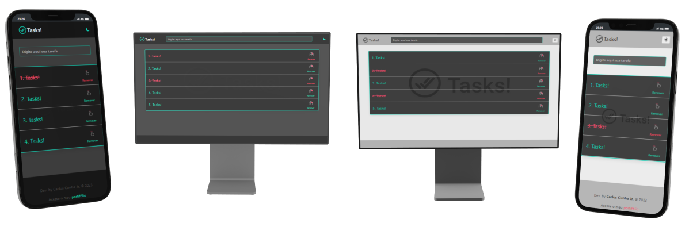

### [ToDo App](https://carloscunha611.github.io/toDo-app/)

    

> Este é um aplicativo de lista de tarefas, desenvolvido utilizando as tecnologias JavaScript, CSS, HTML e Bulma.

## Funcionalidades e Descrições

- Site otimizado para acesso em dispositivos móveis, tablets e desktops.
- Tema claro e escuro.
- Salvamento das tarefas no armazenamento local (localStorage).
- Você pode marcar uma tarefa como concluída clicando nela ou tocando nela em dispositivos com tela sensível ao toque.
- Você pode remover uma tarefa clicando com o botão direito ou segurando o toque em dispositivos com tela sensível ao toque.

    

## ⚙ Tecnologias

- HTML5
- CSS3
- JavaScript
- Git / GitHub
- Framework CSS: [Bulma](https://bulma.io/)

## 🔗 Portfólio e Links

  
  

